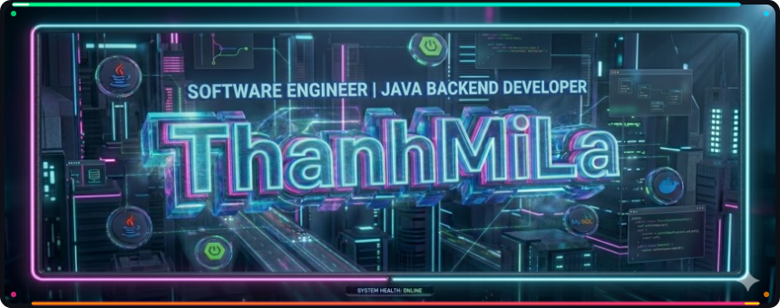

<!-- ════════════════════════════════════════════════════════════ -->
<!--   BANNER + ANIMATED SNAKE BORDER — all-in-one SVG          -->
<!-- ════════════════════════════════════════════════════════════ -->

 

<table width="100%">
<tr>

<!-- ================= LEFT COLUMN ================= -->
<td width="50%" valign="top">

## 📌 Quick Overview

- 🎓 **Identity:** 3rd-year IT Student | FPT University Da Nang
- 🎖️ **Milestones:** 3.75/4.0 GPA • 30% Merit Scholarship
- 💻 **Tech Stack Focus:** Java / Spring Boot Ecosystem
- 🧠 **Areas of Interest:** System Design, High Availability & Scalability
- 🚀 **Mission:** Building clean, maintainable, and production-grade backend architectures

---

## 🔥 GitHub Streak Stats

  

---

### 📈 Most Used Languages

  

---

</td>

<!-- ================= RIGHT COLUMN ================= -->
<td width="50%" valign="top">

## 🛠 Tech Stack

### 💻 Languages

  
  
  
  

---

### ⚙️ Backend

  
  

---

### 🗄 Database

  
  
  
  

---

### ☁️ DevOps & Tools

  
  
  
  
  
  

---

## 🧠 LeetCode Stats

  

---

</td>
</tr>
</table>

---
