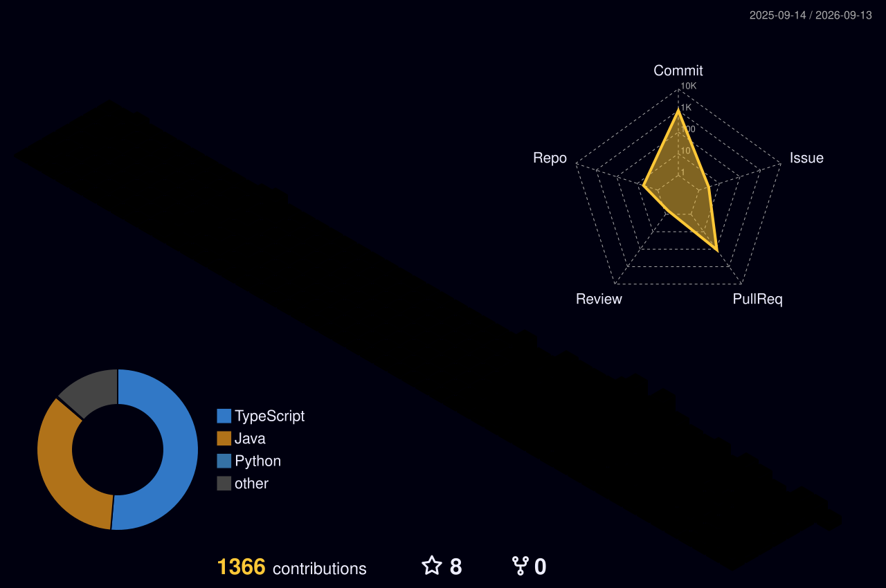
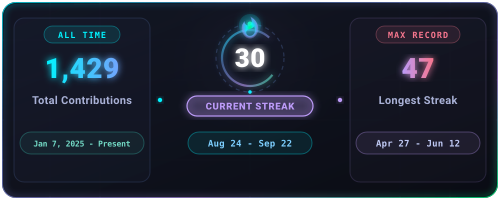
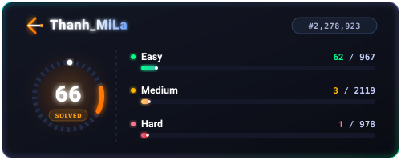

<!-- ════════════════════════════════════════════════════════════ -->
<!--   BENTO HERO: DYNAMIC ANIMATED CYBER BANNER                  -->
<!-- ════════════════════════════════════════════════════════════ -->

 

<!-- ════════════════════════════════════════════════════════════ -->
<!--   BENTO DASHBOARD GRID (Apple / Linear Bento Box Style)     -->
<!-- ════════════════════════════════════════════════════════════ -->

<table width="100%">

<!-- ─── BENTO ROW 1: 3D City & Tech Ecosystem ─── -->
<tr>
<td width="50%" valign="top">

### 🧊 3D Contribution City

  

### 🪐 3D Rotating Tech Sphere

  

</td>
<td width="50%" valign="top">

### 🛠 Core Tech Stack

#### 💻 Languages

  
  
  
  

#### ⚙️ Backend Ecosystem

  
  
  
  
  

#### 🗄️ Database & Caching

  
  
  
  

#### ☁️ DevOps & Tools

  
  
  
  
  

</td>
</tr>

<!-- ─── BENTO ROW 2: GitHub Streak & LeetCode Stats ─── -->
<tr>
<td width="50%" valign="top">

### 🔥 GitHub Streak & Consistency

  

</td>
<td width="50%" valign="top">

### 🧠 Problem Solving & LeetCode

  

</td>
</tr>

<!-- ─── BENTO ROW 3: Languages & Contact ─── -->
<tr>
<td width="50%" valign="top">

### 📈 Most Used Languages

  

</td>
<td width="50%" valign="top">

### 📬 Connect & Collaborate

  
  
  
  

</td>
</tr>

</table>
